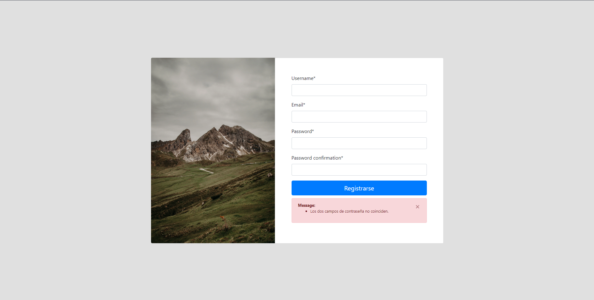
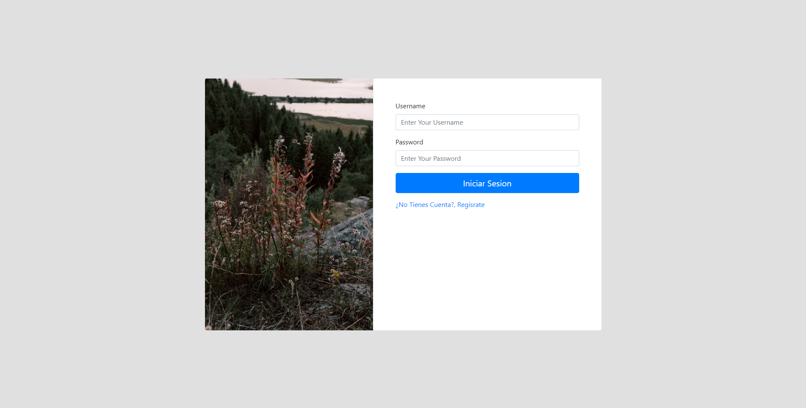
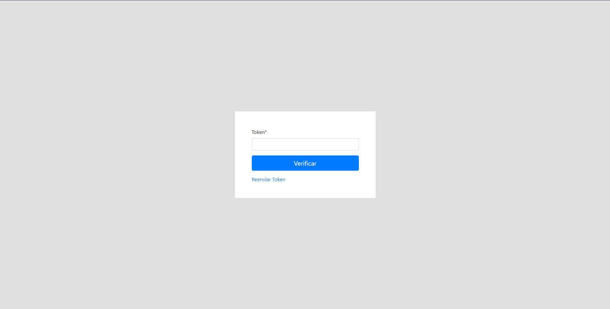
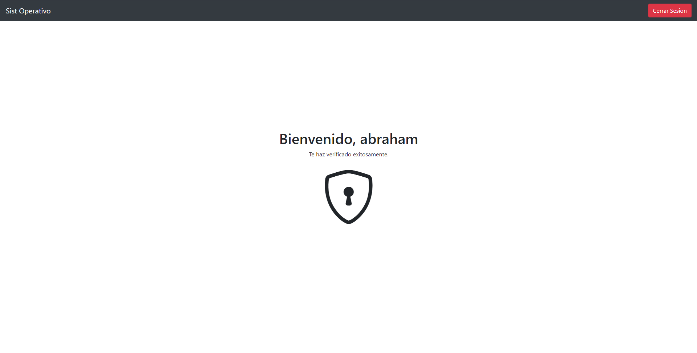
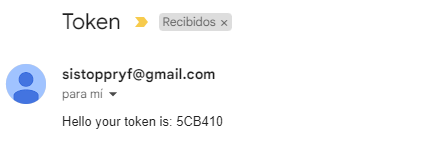

# Two-Factor Authentication App

Este proyecto contiene una de las formas de hacer una aplicación de doble autenticaicon en *django*.

## Tecnologías Usadas:
- [x] Django
- [x] Python
- [x] CSS / BootStrap

## Vistas:

1. **Registro** Contiene todo lo relacionado con la creación de una cuenta de parte del usaurio.

2. **Login:** Contiene todo lo relaciona con el inicio de sesión para el usuario.

3. **Authenticacón** Es el encargado de captar el número secreto *token* que llega al correo del usuario    registrado.

4. **Inicio** Pagina donde al cumplirse el flujo ideal el usuario llega *Menu de Inicio*.

5. **Token Generado** El siguiente llega de manera automática *Puede ser reenviado en vista **Authenticación***.

